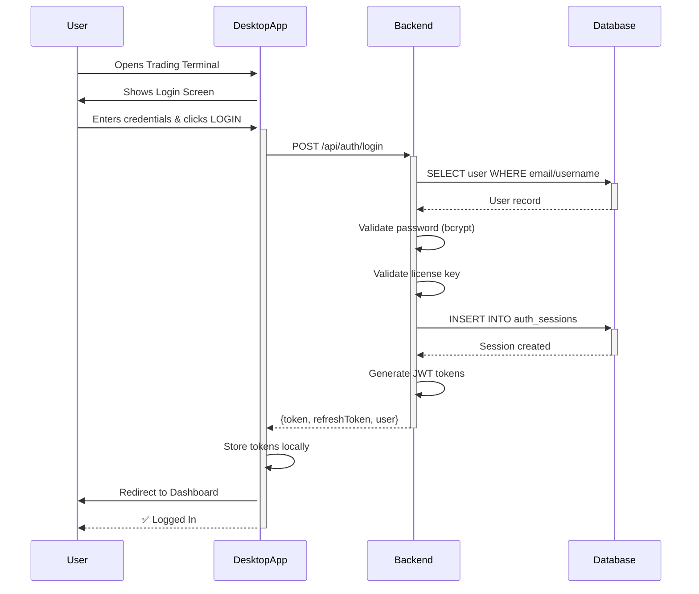

# 📚 Trading Terminal Authentication Documentation Index

## 📖 Documentation Files

### 🚀 **[SETUP_AND_LOGIN_GUIDE.md](SETUP_AND_LOGIN_GUIDE.md)** ⭐ START HERE
**Complete end-to-end guide** for administering user login.
- Default bootstrap credentials
- Getting backend running
- Complete login flow with diagrams
- Creating user accounts
- Session management
- Admin commands cheatsheet
- Example scenarios

**Who**: Administrators, systems engineers  
**Use when**: Setting up the system for first time or onboarding new users

---

### 📋 **[USER_LOGIN_GUIDE.md](USER_LOGIN_GUIDE.md)** 
**Comprehensive user authentication documentation**
- Authentication overview
- Detailed login flow
- Bootstrap account setup
- Creating additional users
- License key management
- Security policies
- Troubleshooting guide
- API endpoint documentation
- User roles & permissions

**Who**: Developers, administrators, support staff  
**Use when**: Need full technical understanding of auth system

---

### ⚡ **[LOGIN_QUICKREF.md](LOGIN_QUICKREF.md)**
**Quick reference card for login information**
- Default credentials
- 5-minute login steps
- License key info
- Common issues one-liner solutions
- Backend status check commands
- Flow diagram
- Direct test examples

**Who**: End users, support staff  
**Use when**: Need quick help or troubleshooting

---

### 🔧 **[PM2_CONFIGURATION.md](PM2_CONFIGURATION.md)**
**Complete PM2 process management documentation**
- Configuration details
- Setup instructions
- Managing processes
- Monitoring & performance
- Advanced configuration
- Troubleshooting PM2 issues
- Production checklist

**Who**: DevOps, system administrators  
**Use when**: Managing backend process lifecycle

---

### ⏱️ **[PM2_QUICKREF.md](PM2_QUICKREF.md)**
**Quick PM2 commands reference**
- Common commands
- Debugging tips
- Status checks
- Troubleshooting
- Configuration summary

**Who**: All users  
**Use when**: Need quick PM2 command reminder

---

### 📦 **[DEPLOYMENT_QUICKSTART.md](DEPLOYMENT_QUICKSTART.md)**
**Quick deploy guide for remote server**
- Deployment package summary
- Quickest path to deployment
- Verification commands
- Pre-deployment checklist
- Helpful commands
- Troubleshooting

**Who**: DevOps engineers  
**Use when**: Deploying to remote server

---

### 📝 **[BACKEND_DEPLOYMENT.md](BACKEND_DEPLOYMENT.md)**
**Detailed backend deployment documentation**
- Quick start (manual & automated)
- Configuration details
- Database prerequisites
- Redis prerequisites
- Accessing backend
- Troubleshooting
- Security recommendations

**Who**: DevOps engineers, backend developers  
**Use when**: Deploying backend service

---

## 🎯 Quick Navigation

### I want to...

**"...deploy the backend"**
→ [DEPLOYMENT_QUICKSTART.md](DEPLOYMENT_QUICKSTART.md)  
→ [BACKEND_DEPLOYMENT.md](BACKEND_DEPLOYMENT.md)

**"...set up user login"**
→ [SETUP_AND_LOGIN_GUIDE.md](SETUP_AND_LOGIN_GUIDE.md) ⭐

**"...understand authentication"**
→ [USER_LOGIN_GUIDE.md](USER_LOGIN_GUIDE.md)

**"...quick facts on login"**
→ [LOGIN_QUICKREF.md](LOGIN_QUICKREF.md)

**"...manage the backend process"**
→ [PM2_CONFIGURATION.md](PM2_CONFIGURATION.md)

**"...PM2 commands"**
→ [PM2_QUICKREF.md](PM2_QUICKREF.md)

---

## 🔐 Default Credentials

These are configured in `.env.production`:

```
Email:      admin@example.com
Username:   admin
Password:   <set-in-env>
License:    <set-in-env>
```

⚠️ **Change after first login for production!**

---

## 🚀 Quick Start (5 min)

### 1. Start Backend
```bash
cd /home/ubuntu/projects/TradingTerminal-SourceCode
pm2 start apps/backend/ecosystem.config.js --env production
pm2 status
```

### 2. Check It's Running
```bash
curl http://api.example.com:8787/health
```

### 3. Open Trading Terminal
- Desktop app or
- Browser: `http://api.example.com:8787`

### 4. Login
```
Email/Username: admin
Password:       <set-in-env>
License Key:    <set-in-env>
```

### 5. Create More Users
Use admin panel or database

---

## 📊 System Architecture

```
┌──────────────────────────────────────────────────────────────┐
│                    TRADING TERMINAL                          │
├──────────────────────────────────────────────────────────────┤
│                                                              │
│  ┌────────────────────┐          ┌────────────────────┐    │
│  │  Desktop App       │          │  Web Browser       │    │
│  │  (Electron)        │          │  (React)           │    │
│  └─────────┬──────────┘          └─────────┬──────────┘    │
│            │                              │                 │
│            └──────────────┬───────────────┘                 │
│                           │ HTTP/REST                       │
│                           ↓                                 │
│            ┌────────────────────────────┐                  │
│            │   Backend Server (Node.js) │                  │
│            │   Port 8787                │                  │
│            │                            │                  │
│            │  ┌──────────────────────┐  │                  │
│            │  │ Authentication (JWT) │  │                  │
│            │  │ /api/auth/login      │  │                  │
│            │  │ /api/auth/signup     │  │                  │
│            │  │ /api/auth/refresh    │  │                  │
│            │  └──────────────────────┘  │                  │
│            │                            │                  │
│            │  ┌──────────────────────┐  │                  │
│            │  │ Other API Endpoints  │  │                  │
│            │  │ /api/...             │  │                  │
│            │  └──────────────────────┘  │                  │
│            └────────┬──────────┬─────────┘                  │
│                     │          │                           │
│                     ↓          ↓                           │
│          ┌──────────────┐  ┌─────────┐                    │
│          │ PostgreSQL   │  │ Redis   │                    │
│          │ auth_users   │  │ Cache   │                    │
│          │ auth_sessions│  │         │                    │
│          └──────────────┘  └─────────┘                    │
│                                                              │
└──────────────────────────────────────────────────────────────┘
```

---

## 🔄 Login Sequence



---

## 🛠️ Configuration Files

| File | Purpose |
|------|---------|
| `.env.production` | Runtime config & credentials |
| `apps/backend/ecosystem.config.js` | PM2 process config |
| `apps/backend/src/auth.ts` | Authentication service |
| `apps/backend/src/server.ts` | Express server & routes |
| `apps/backend/migrations/008_auth_identity_foundation.sql` | Database schema |

---

## 📞 Support Resources

### Logs
- **Backend logs**: `pm2 logs trading-terminal-backend`
- **System logs**: `journalctl -u pm2-ubuntu -f`
- **Database logs**: `postgresql` service logs

### Commands
- **Status**: `pm2 status`
- **Restart**: `pm2 restart trading-terminal-backend`
- **Database access**: `psql -d trading_terminal`
- **Test API**: `curl -X POST http://localhost:8787/api/auth/login ...`

### Documentation
- **This index**: `AUTHENTICATION_INDEX.md` (this file)
- **Setup guide**: [SETUP_AND_LOGIN_GUIDE.md](SETUP_AND_LOGIN_GUIDE.md)
- **User guide**: [USER_LOGIN_GUIDE.md](USER_LOGIN_GUIDE.md)
- **Quick ref**: [LOGIN_QUICKREF.md](LOGIN_QUICKREF.md)

---

## ✅ Verification Checklist

After setup, verify:

- [ ] Backend running: `pm2 status`
- [ ] Backend accessible: `curl http://api.example.com:8787/health`
- [ ] Database connected: Check logs for DB errors
- [ ] Bootstrap account exists: Can login with default creds
- [ ] Sessions created: Query `auth_sessions` table
- [ ] Tokens valid: Can refresh and make API calls
- [ ] New users can signup: Try "CREATE ACCOUNT"
- [ ] Existing users can login: Try with created account
- [ ] Logout works: Sessions marked as revoked
- [ ] Token refresh works: Token auto-renewed on API call

---

## 🎓 Learning Path

**For Developers:**
1. Read [USER_LOGIN_GUIDE.md](USER_LOGIN_GUIDE.md) - understand system
2. Review `apps/backend/src/auth.ts` - authentication logic
3. Check `apps/backend/src/server.ts` - API endpoints
4. Test `curl` examples from [LOGIN_QUICKREF.md](LOGIN_QUICKREF.md)

**For Administrators:**
1. Start with [SETUP_AND_LOGIN_GUIDE.md](SETUP_AND_LOGIN_GUIDE.md) ⭐
2. Use [PM2_CONFIGURATION.md](PM2_CONFIGURATION.md) for process management
3. Reference [LOGIN_QUICKREF.md](LOGIN_QUICKREF.md) for day-to-day operations

**For Users:**
1. Check [LOGIN_QUICKREF.md](LOGIN_QUICKREF.md) for login steps
2. Review [USER_LOGIN_GUIDE.md](USER_LOGIN_GUIDE.md) for detailed info
3. Contact support for issues not covered

---

## 📈 What's Included

✅ Fully configured authentication system  
✅ Bootstrap admin account  
✅ Database schema for users/sessions  
✅ JWT token generation & validation  
✅ Password hashing with bcrypt  
✅ Session management & tracking  
✅ License key validation  
✅ Role-based access control  
✅ Token refresh mechanism  
✅ Comprehensive documentation  
✅ PM2 process management  
✅ Deployment scripts  

---

## 🔒 Security Notes

📋 **Pre-Production Checklist:**
- [ ] Change bootstrap password
- [ ] Rotate JWT_SECRET
- [ ] Enable HTTPS/TLS
- [ ] Set strong database password
- [ ] Configure password policy
- [ ] Enable 2FA (TOTP)
- [ ] Set up audit logging
- [ ] Configure rate limiting
- [ ] Regular security updates
- [ ] Backup strategy in place

---

**Version**: 1.0  
**Last Updated**: April 1, 2026  
**Status**: ✅ Complete & Ready
